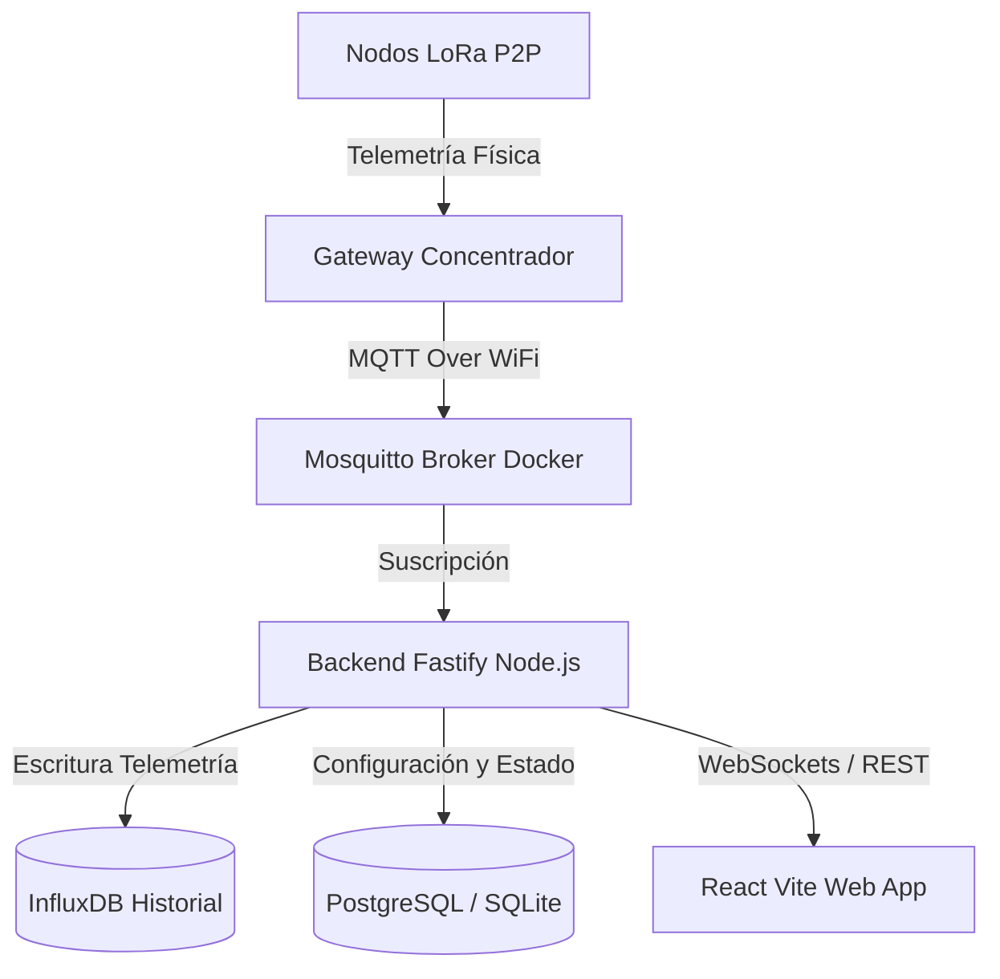

# AI Handoff & Developer Guide: EcoSmart IoT

Este archivo contiene la especificación de diseño, restricciones arquitectónicas, cambios recientes y guías de despliegue para el proyecto **EcoSmart IoT**. Cualquier IA o desarrollador que continúe el trabajo debe leer y seguir estas directrices estrictamente.

---

## 1. Restricciones Críticas del Proyecto (Leyes Inquebrantables)

* **Protocolo de Comunicación**: El sistema funciona únicamente con **LoRa P2P (Peer-to-Peer)** directo. **NUNCA** menciones, sugieras ni configures **LoRaWAN** en ninguna sección de código, interfaz o documentación.
* **Métricas Excluidas**: Se ha deprecado y removido por completo el uso de sensores de **Temperatura y Humedad**. No deben mostrarse widgets, gráficos ni etiquetas referentes a clima en ninguna pantalla. En su lugar, utiliza telemetría de **Calidad del Aire (Air Quality)** y **Satélites GPS**.
* **Estilo de Diseño**: La interfaz debe seguir un diseño profesional limpio estilo **Google Cloud Console / Material Design 3**.
  * **Sin bordes rígidos o exagerados**: Utiliza fondos planos semi-translúcidos (`rgba(...)`) y sombras muy sutiles.
  * **Iconografía Neutra**: Los iconos estáticos en los KPIs superiores y paneles deben ser de color neutro (`text.secondary` con opacidad suave) para no sobrecargar visualmente la pantalla.
  * **Colores de Estado de Google**: Para alertas dinámicas, utiliza la paleta oficial:
    * Crítico: Rojo Google (`#ea4335`)
    * Advertencia: Ámbar Google (`#f9ab00`)
    * Óptimo/Seguro: Verde Google (`#34a853`)
    * Enlaces/Sincronización: Azul Google (`#1a73e8`)

---

## 2. Arquitectura de Software

El sistema es un entorno IoT completo desplegado en Docker:



### Tecnologías Clave:
* **Frontend**: React (Vite + TypeScript), Material UI (MUI) v6, Framer Motion (para transiciones y animaciones), y MapLibre GL para los visores cartográficos.
* **Backend**: Node.js con Fastify (TypeScript), InfluxDB para series temporales de telemetría y SQLite/Postgres para la persistencia relacional.
* **Firmware**: Código en C/C++ (Arduino IDE/PlatformIO) para módulos ESP32 + módulo LoRa (SX1276/SX1278).

---

## 3. Estado de las Secciones y Cambios Recientes

### A. Panel de Control Principal (`Overview.tsx`)
* Diseñado como consola de operaciones unificada.
* Calcula dinámicamente el promedio del indicador de señal RSSI de la red basándose en los datos vivos de la base de datos.
* Mapea coordenadas a direcciones legibles callejeras en Arequipa para mostrar ubicaciones exactas en lugar de coordenadas puras.

### B. Gestión de Contenedores (`Bins.tsx`)
* **Layout Grid/Table**: Dispone de un selector para alternar entre vista compacta (tabla para 20+ nodos) y vista de tarjetas original.
* **Transiciones de Imagen 3D**: Las tarjetas de cuadrícula cuentan con animaciones escalonadas de entrada (`framer-motion`), mostrando a la derecha el modelo de contenedor y a la izquierda los datos de nivel de llenado.
* **Corrección MUI v6**: Para campos de texto modificables, se usa estrictamente la prop `slotProps={{ htmlInput: { step: 'any' } }}` en lugar del obsoleto `inputProps` para evitar errores de compilación TypeScript.

### C. Mapas y Rutas (`Routes.tsx`, `RouteMap.tsx` y `MapPreview.tsx`)
* **Estilos del Mapa**: Debido a bloqueos y lentitud en los servidores de *OpenFreeMap*, ambos visores se migraron a proveedores de mapas rasterizados:
  * **Modo Noche / Claro**: CartoDB (`dark_all` / `light_all`).
  * **Satélite / Híbrido**: ESRI World Imagery y etiquetas de CartoDB.
  * **Modo Terreno**: Consumido directamente desde los servidores de **Google Terrain (`lyrs=p`)**, proporcionando relieve topográfico real.
* **Optimizador de Ruta Inteligente por IA (EcoRoute)**:
  * Se implementó una pestaña adicional en el sidebar de Rutas para alternar entre "Manual" y "IA EcoRoute".
  * **Algoritmo TSP (Nearest Neighbor)**: Evalúa las coordenadas de los contenedores casi desbordados (capacidad ≥ 70%, o los top 3 con mayor nivel como fallback) y los ordena partiendo del Depósito Municipal (`[-71.5375, -16.4090]`) para minimizar la distancia Euclidiana total.
  * **Sincronización OSRM**: Inyecta los puntos ordenados a `RouteMap.tsx` a través de refs expuestas (`setPoints`), gatillando la generación del trayecto óptimo por calles reales.
  * **Deducción de Ahorros Ecológicos**: Permite seleccionar camiones Compactadores (12 km/gal) o Urbanos (18 km/gal). Deduce la reducción de combustible y calcula el ahorro de CO₂ utilizando el factor estándar de emisiones de diésel de la EPA (~10.15 kg de CO₂ por galón salvado).
* **Panel de Red del Mapa 3D**: El panel derecho (`Drawer`) fue rediseñado. Se removieron sus bordes, su fondo se integró con la variable del menú lateral (`var(--bg-sidebar)`) con desenfoque de fondo (`backdropFilter`) para un acabado transparente armónico. 
* **Corrección de Batería 0%**: Se reparó el bug en la barra lateral del mapa 3D donde la batería siempre leía `0%` por fallback indefinido; ahora lee correctamente la telemetría viva y la base de datos.
* **Capa Terreno Desbloqueada**: Se eliminó un efecto colateral de sincronización automática de temas en `MapPreview.tsx` que pisaba la capa "Terreno" devolviéndola al modo nocturno inmediatamente después de seleccionarla.

### D. Icono del Navegador (Favicon)
* Se creó un favicon SVG personalizado (`web_app/public/favicon.svg`) con un brote ecológico en verde y ondas de transmisión LoRa, reemplazando el icono por defecto de React.

---

## 4. Estructura de Archivos Clave

* **Páginas**:
  * [`Overview.tsx`](file:///e:/ING%20DE%20TELECOMUNICACIONES/PROYECTOS/PROYECTO%20FINAL/SOFTWARE/web_app/src/pages/Overview.tsx): Consola principal.
  * [`Bins.tsx`](file:///e:/ING%20DE%20TELECOMUNICACIONES/PROYECTOS/PROYECTO%20FINAL/SOFTWARE/web_app/src/pages/Bins.tsx): Inventario y control de contenedores.
  * [`Routes.tsx`](file:///e:/ING%20DE%20TELECOMUNICACIONES/PROYECTOS/PROYECTO%20FINAL/SOFTWARE/web_app/src/pages/Routes.tsx): Gestión y dibujo de rutas de recolección.
* **Componentes de Mapa**:
  * [`MapPreview.tsx`](file:///e:/ING%20DE%20TELECOMUNICACIONES/PROYECTOS/PROYECTO%20FINAL/SOFTWARE/web_app/src/components/dashboard/MapPreview/MapPreview.tsx): Visor 3D y barra lateral de telemetría IoT.
  * [`RouteMap.tsx`](file:///e:/ING%20DE%20TELECOMUNICACIONES/PROYECTOS/PROYECTO%20FINAL/SOFTWARE/web_app/src/components/dashboard/RouteMap/RouteMap.tsx): Visor para trazar y persistir las rutas de camiones.
* **Configuraciones Globales**:
  * [`index.html`](file:///e:/ING%20DE%20TELECOMUNICACIONES/PROYECTOS/PROYECTO%20FINAL/SOFTWARE/web_app/public/index.html): Punto de entrada y meta-tags.

---

## 5. Guía de Despliegue en Servidor VPS

El código corre sobre un contenedor Docker en la dirección IP VPS **`145.79.1.173`**.

Para compilar y desplegar cualquier cambio realizado en este repositorio:
1. Accede mediante SSH a la terminal del VPS.
2. Navega a la carpeta del proyecto.
3. Ejecuta los siguientes comandos para actualizar el software:

```bash
# 1. Traer los últimos commits del repositorio remoto
git pull

# 2. Re-compilar y levantar los contenedores Docker en segundo plano
docker compose up -d --build
```
